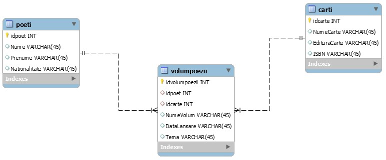
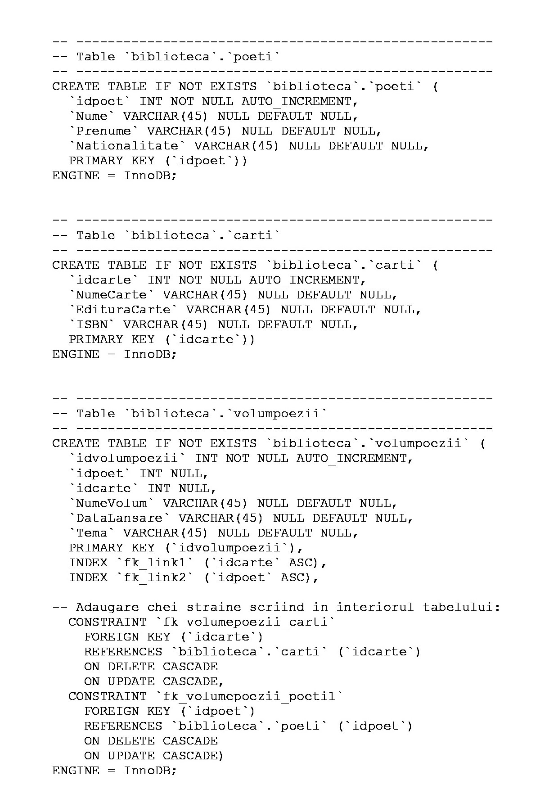
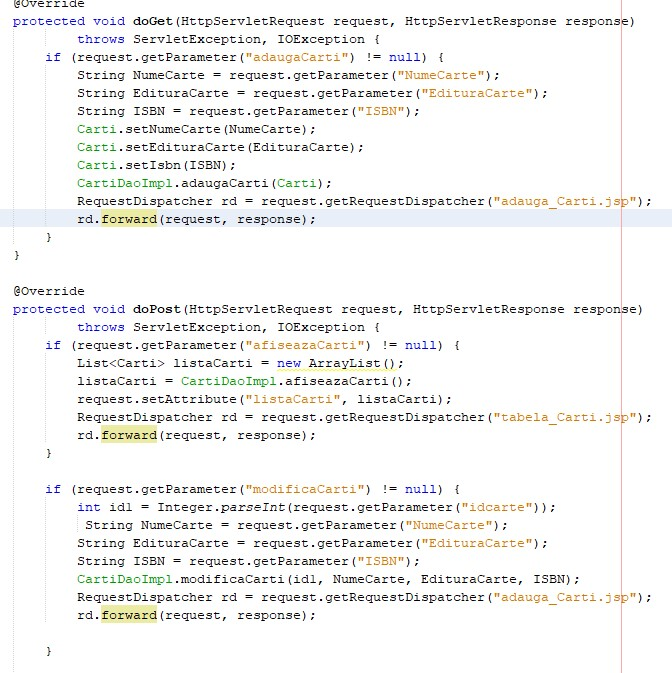
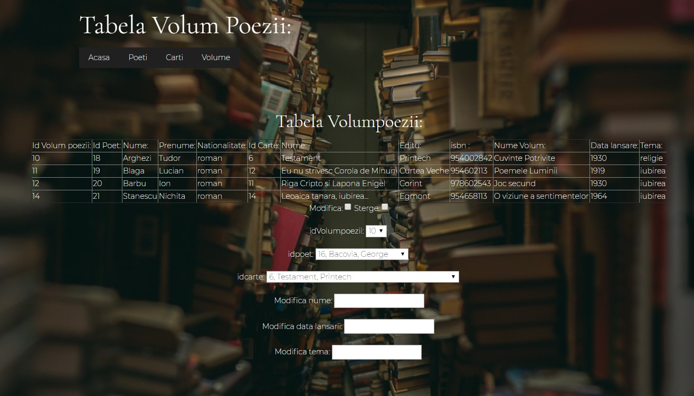
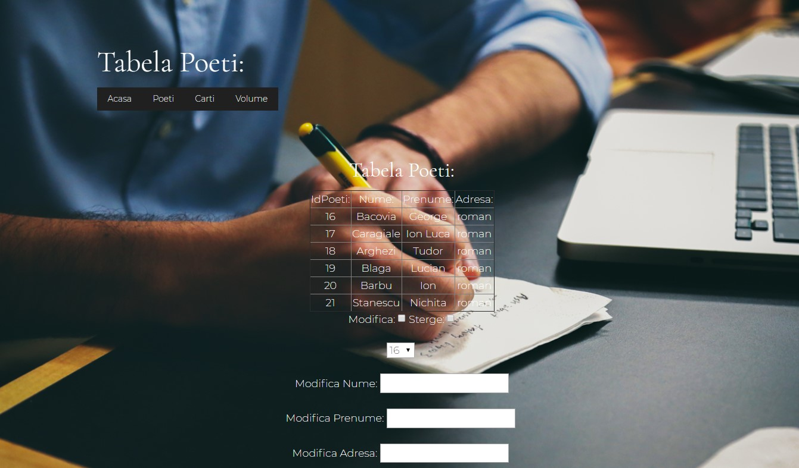
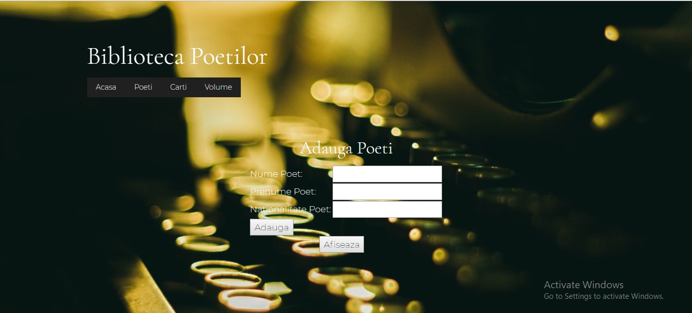

# WebAPI-Hibernate
Web application containing a database created in MySQL using Hibernate technology for interface.

<b>NOTE: 
The Java code (.java files) was written by the coordinating teacher. 
In this project I had to make the database (using MySQL), correct and modify the Java code for my specific application & create the web interface (using HTML, JS, CSS, Bootstrap: Pingendo).</b>

A database is an organized collection of data, generally stored and electronically accessed from a computer system. 
If databases are more complex, they are often developed using formal design and modeling techniques.

In this project, I had to create a database containing "Poet" and "Books" tables,
the M:N association being made through the "Poetry Volumes" association table.

This diagram can be done either in the MySQL Model environment or by writing the following SQL code:

Hibernate is an ORM solution to ensure the persistence and efficient querying of information stored in relational databases through the Java programming language.

Here is a sample of the link between the "books" table and the application:

The final result of this Web Application (using Pingendo Bootstrap):

